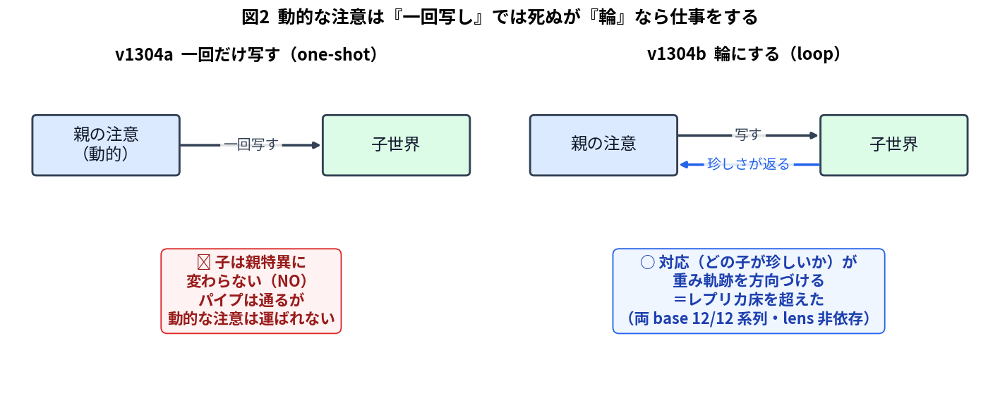
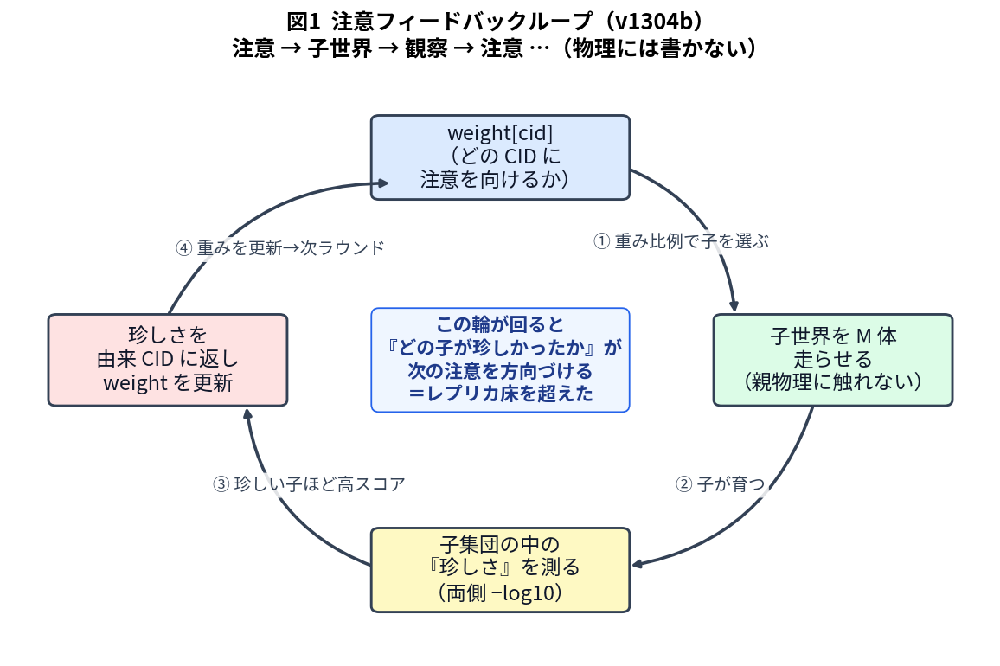
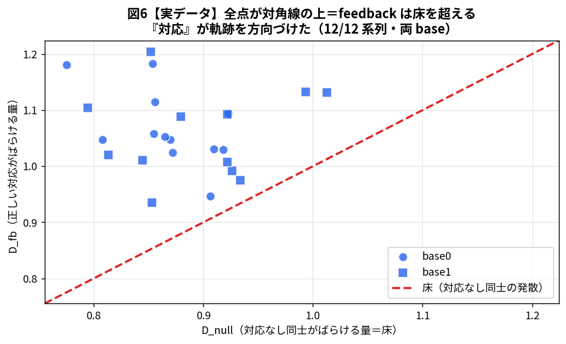
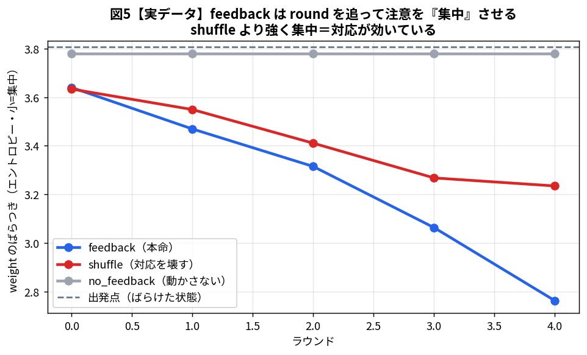
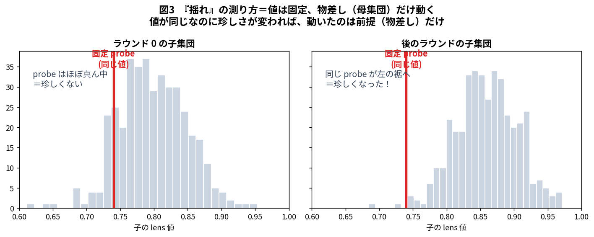
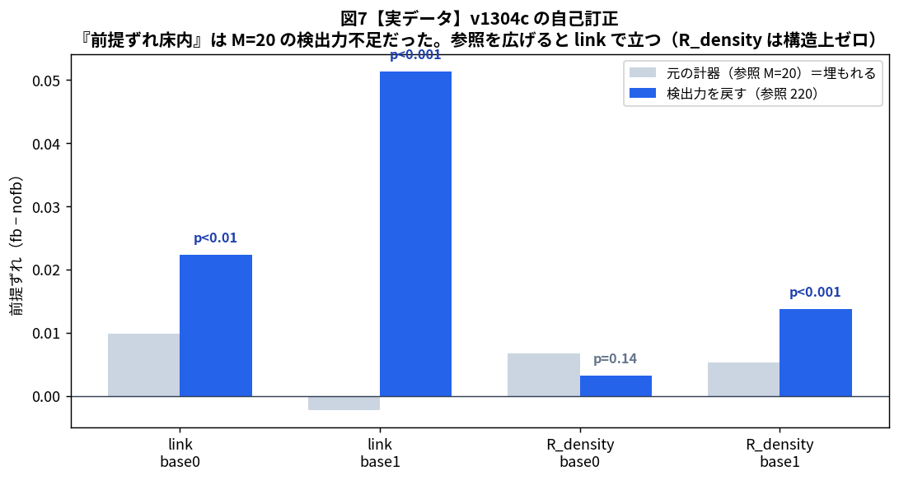
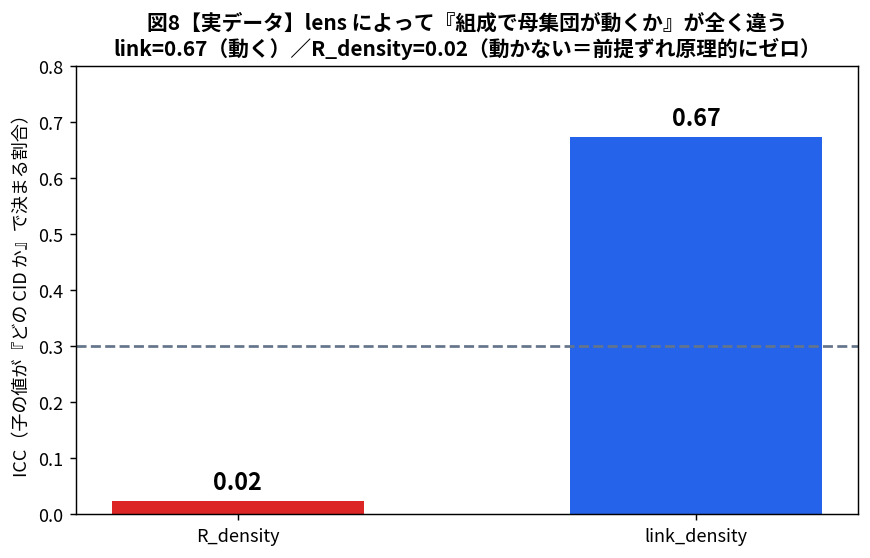
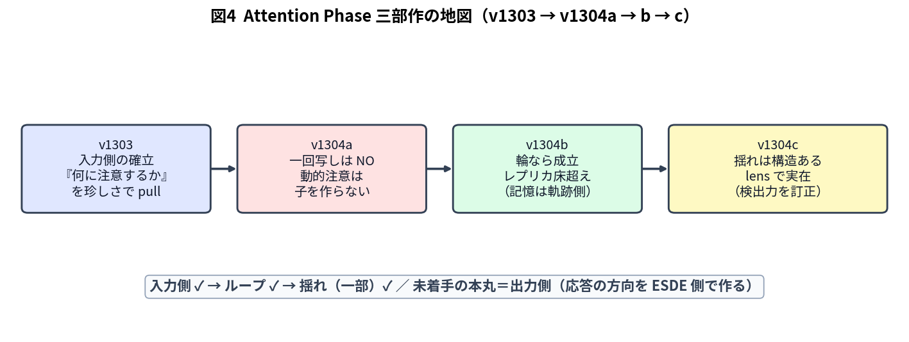

# ESDE 概念理解 v2（バカでもわかる版・Attention Phase）

*作成*: 2026-07-04、Code A / *対象読者*: Taka（と将来の自分・新しい AI）
*範囲*: **v1301 あたりから現在（v1304）まで**。それ以前は「前提」として §0 に最小限だけ。
*方針*: 数字の羅列でなく「**こう作れば、こう動く**」の話。専門用語は出すたびに一言の日本語言い換えを添える。**成功も失敗も同じ重さ**で書く。図を多用する。
*v1 との関係*: v1114 までの概念辞典は `docs/概念理解.md`（v1・凍結）。本 v2 はその続き。

> **この Phase の名前について（遡及命名）**：v1301 以降を **Attention Phase（注意フェーズ）** と呼ぶ（2026-07-04 Taka 判断）。ただし v1301–1302 は当時 child-world（子世界）という別テーマとして走らせていた。「ここが注意センターの中枢になる」と分かったのは後から。だから名前は後付け、という史実は残す。

---

## 0. 前提（v1114 まで・ここだけ超要約）

ESDE ＝「小さな点（node）がつながって形（構造）を作り、その形が意味より先に立ち上がる」人工世界。ルールは **物理層（＝床）** に凍結されていて、**上から物理を直接書き換えるのは禁止**（過去に何度もやって崩壊した）。

そこに **CID（cognitive identity＝一体分の識別子。「その世界に生まれた一個の主体」くらいの意味）** が生まれる。CID は「珍しいこと」を拾う。v1114 で、この「珍しさを拾って何かに注意を向ける中枢」＝**注意センター** の最初の形（Step1）ができた。

ここまでで分かっていた大事なこと：
- **直接、物理を書く経路は全部ダメ**（＝神の手は効かない）。だから「**系が自分で条件を決める仕組み**」を作るしかない。それが「注意」。
- **量を増やしても、選ぶ仕組みがなければ形は生まれない**（＝「選択なき循環は洗濯機」）。

Attention Phase は、この「注意センター」を主役にして、**注意が別の小さな世界（子世界）をどう作り、どう跳ね返ってくるか** を調べる旅。

---

## 1. 前史 — 子世界（v1301 / v1302）：「親に似せる」は空振りだった

### v1301 — 親の形を子世界の物理法則に写してみる（静的）
**作ろうとしたもの**：親 ESDE の各 CID が持つ「生まれつきの形」を、**別の小さな ESDE（子世界）の物理法則のツマミ**に写して回し、「どんな構造が生まれるか」の傾向マップを取る。ツマミは4本（子の大きさ・つながりやすさ・同期の強さ・初期の位相）。

**起きたこと**：ちゃんと動いた。素直に見ると「効いている」向きの相関も出た。**でも、伝達は『たくさんの seed（乱数の種＝走らせるたびに変わるランダムさ）を平均して初めて見える弱い磁気』で、子1体では雑音に埋もれて親を見分けられない**。

**教訓**：**集団平均の像を、個体の像と取り違えるな**。平均すれば見えるが、一個の子は親を語らない。

### v1302 — 親の「経験」を子の物理演算に動的に注入（撤回）
**作ろうとしたもの**：初期条件だけでなく、親の「経験・成熟」を子の物理**演算そのもの**に注入して、偏り（構造のクセ）を増幅する。

**起きたこと＝三重の失敗（ここが大事）**：
1. **鎖が途中で切れた**：設計の中心「成熟 → 同期を強める → 偏りが増える」が、エンジンの中で成立しない。同期を強めても、偏り（閉路・クラスタ）は**つながり方（topology）で決まって位相に依らない**。最初の矢印で鎖が切れた。
2. **言い換えだった（トートロジー）**：残った経路も、**自分で回したツマミ（つながりやすさ）が機械的に動かすもの（子の統計）を動かした事実を、『親の性質を継承した』と言い換えていた**だけ。ツマミの効果を差し引くと、親↔子の残りの相関はほぼゼロ。
3. **空っぽスタートのインチキ信号**：「親の構造を子に移植」した版は、容量の8割が空のエンジンに小移植して育て直したもので、条件を揃えると唯一の正信号が**反転して消えた**（偽物だった）。

**教訓（次への一番大事な含意）**：**「親に似ているか？」という問いの立て方自体が空**。測る相手を「親に似ているか」→「**基準の系（canon）と統計的に違う系か**」に変えるべき。→ ここから注意（v1303）へ。

---

## 2. v1303 — 「何に注意を向けるか」を確立した（入力側）

**作ろうとしたもの**：親 ESDE が「**自分の珍しさを手がかりに、何に注意を向ける候補にするか**」を決める入力側の部品。いくつもの「目（emitter＝観察の窓口）」を棚卸しし、研究者が勝手なしきい値を入れずに、**珍しさが候補を1つ引く**仕組みにして、出力の形（schema）を固定する。

**起きたこと＝落とし穴を2つ実証してから固めた**：
- **1回だけ引くと、当たりは『ただの偶然』に潰れる**（≈1/候補数）。目が別物かどうかの判定に使えない。
- **時間平均を取ると、どの目も『一様（＝全部同じ）』に潰れる**（平均化の罠）。
- → **本体を「各時刻ごとの選択確率」に移した**ら、初めて目が互いに別物で、かつ「一様」と区別できるようになった。
- おまけ：計算コストを **30倍も過小に見積もっていた**のに気づき（小規模の値を大規模に無批判に流用）、承認の前提が崩れたので止めて報告した。

**固めたもの（クローズの3点）**：
1. **eye registry（目の登録簿）を固定**：正式4眼（今の同期／過去の同期の順位／つながりの珍しさ／生まれつきの珍しさ）＋補助1。
2. **本体＝各時刻の選択確率**（乱数不要で厳密）。
3. **注意の出力の形（schema）を固定**。

**分かったこと**：新しく効いた独立の軸は「位相でない、つながりの珍しさ」だけ。注意の中身は「5つの独立な系」ではなく「**互いに相関する動的なかたまり ＋ 生まれつきの珍しさ（これだけ独立）**」。多彩さは思ったより薄い。

---

## 3. v1304a — 動的な注意は「一回写し」では子世界を作らない（NO）

**作ろうとしたもの**：v1303 で作った注意（どの CID をどれくらい見るか）を、子世界に**一回だけ**写して、「子が『親特異な別の系』として立つか」を見る。

**起きたこと**：**立たない（NO）**。4つの見方が同じ結論に収束した ―― 動的な注意は「一回写す」形では子を親特異に作らない。配管（パイプ）自体は通るが、動的な注意はそこを運ばれない。念のため、子を走らせずに相関だけスキャンしても、「実証済みの管に届く動的な珍しさ」は見つからなかった。

**分かったこと**：一回写しは死ぬ。**でも『輪（ループ）』にすればどうか？** ―― これが次の問い。

---

## 4. v1304b — 輪にしたら成立した（レプリカ床超え）

**作ろうとしたもの**：注意を一回写して終わりでなく、**輪**にする。物理には書かない（親は読むだけ）。子世界を「センターの第二の観察対象」に足す。輪の1周は図1の通り：

1. 今の注意の重み（weight）に比例して子を選ぶ、
2. 子を走らせる、
3. 子集団の中での「珍しさ」を測って、由来の CID に返す、
4. 珍しい子を出した CID の重みを上げる → 次の周へ。

**どう判定したか（ズルをしない工夫）**：ただ「注意が子を見た」だけなら当たり前。非自明なのは「**どの CID の子が珍しかったか、が次の注意を方向づけたか**」。そこで **レプリカ null 法**（＝「対応をわざと壊した偽物（shuffle）を10本、同じ世界に相乗りさせ、偽物同士がどれだけ勝手にばらけるか＝床を作る」。子は1体も増やさない、ただの計算）を使った。

**起きたこと＝床を超えた**：本物（正しい対応）のばらけ方が、偽物同士のばらけ方（床）を**超えた**。全部の系列で、両方の乱数系列で。しかも：

- 本物（feedback）は round を追って注意を**集中**させ、偽物（shuffle）より強く集中する（図5）。
- **別のものさし（lens）に変えても再現**した ＝ 特定の指標のクセではなく、**輪の仕組みそのものの性質**。
- **『個体の持続性』がゼロでも効いた** ＝ **記憶は、個々の CID にではなく、weight の『たどってきた道（軌跡）』の側に宿り得る**。

**言える上限（言い過ぎない）**：「**対応が weight の軌跡を方向づけた（床を超えた）**」まで。「学習した」「自律的な注意が成立した」とは言わない。

---

## 5. v1304c — 「揺れ」を測る、そして自分の計器を疑って訂正した

Taka の問い：「系が多彩になると、連続を重ねて傾向を取り、それを注意にフィードバックする。すると**時間で統計の前提そのものがずれていく**。この『揺れ』こそ、静的な統計と違うところだ」。これを直接測る。

**作ろうとしたもの＝固定 probe 法**（図3）：ある時点の子の値を**固定**しておき、後のラウンドの子集団に対して「珍しさ」を測り直す。**値は同じなのに珍しさが動けば、動いたのは物差し（前提）だけ** ―― これが「揺れ」の直接測定。

**一度、間違えた**：最初は「揺れは、ただのランダムなブレの範囲内（前提はずれない）」と報告した。

**Taka の指摘「計器そのものを疑え」で自己監査 → 訂正した**（ここが今回一番大事）：

- **検出力不足だった**：物差しを測る母集団がたった20体で、「珍しさ」の推定がノイズだらけ。真の信号がノイズに埋もれていた。**母集団を220体に広げたら、link のものさしでは前提ずれが両方の乱数系列でハッキリ立った**（図7の青）。**前提は、時間で進行的にずれていた**。「揺れは無い」は誤りだった。

- **もう一つのものさし（R_density）は、そもそも揺れようがなかった**（図8）：この指標は「どの CID か」でほとんど決まらない（ICC＝子の値がCIDで決まる割合＝0.02）。**組成が変わっても母集団が動かないので、前提ずれは構造上ゼロ**。これを「自己確認を外すものさし」に選んだのは、**この指標では原理的に結果が出ない実験**だった。

**分かったこと**：
- **構造（信号）を持つものさしでは、前提は本当に時間でずれる**（当初の「揺れ無し」は測り方の失敗）。ただしその揺れは「つながりやすさツマミ」と結びついた面がある（自己確認の色は残る）。
- **v1304b の効き（ものさしに依らない）は、前提ずれ（ものさしに依る）では説明できない** ―― R_density は v1304b では効くのに前提ずれは構造ゼロ。だから **記憶はやはり weight の軌跡側にある**（この結論は訂正後も変わらず、むしろ強まった）。

**教訓（新しい失敗型）**：**null（効果なし）と結論する前に、必ず「検出力」と「構造（ICC）」を測れ**。実装が算術的に正しい（検算OK）だけでは足りない。小さい標本で「珍しさ（tail 量）」を主判定に使うな。「negative でも発見」という枠は、油断すると **null を無批判に受け入れる免罪符**になる。

---

## 6. いま、どこにいて、次に何がありうるか

- **入力側 ✓**（v1303）：珍しさで「何に注意するか」を選び、形を固定した。
- **ループ ✓**（v1304b）：注意→子→観察→注意 の輪が、対応を通じて注意の軌跡を方向づける（床超え・ものさし非依存・持続性非依存）。
- **揺れ（一部）✓**（v1304c）：構造を持つものさしでは、前提は時間でずれる（ただし検出力の確保が要る・訂正済み）。

**未着手の本丸＝出力側**：注意が世界を作り込み、それが「**応答の方向**」を生む経路。いまは「注意が何を見て、どう跳ね返るか」までで、「その注意から ESDE が**自分で応答の向きを作る**」ところはまだ。ここが「会話できる ESDE」に向けた次の本丸。

**次にありうること（判定は Taka）**：
- v1304c の前提ずれを「参照を最初から広げた」正式版で閉じ直す。
- 「注意でない、つながりの側」のものさし（例：閉路への参加度）で三点目の確認。
- 親を1体でなく複数にして、一般化を見る。
- 出力側（応答方向の生成）の設計に入る。

---

## 付録：ミニ用語辞典（この資料に出た専門語の一言言い換え）

| 用語 | 一言でいうと |
|---|---|
| CID（cognitive identity） | その世界に生まれた「一個の主体」 |
| 子世界（child-world） | 親の縮小版の小さな ESDE。親物理には触れない |
| 物理層 frozen | ルールは凍結・上から書き換え禁止（＝床） |
| 注意センター | 珍しさを拾って「何を見るか」を決める中枢 |
| eye / emitter（目） | 観察の窓口。何を「珍しい」と見るかの視点 |
| weight（重み） | どの CID をどれくらい見るか、の配分 |
| lens（ものさし） | 子の何を測るか（つながり密度・閉路率…） |
| 珍しさ（−log10） | 集団の中でどれだけ外れているか。外れるほど高い |
| レプリカ null 法 | 対応を壊した偽物を並べて「ただのブレの床」を作る検算 |
| 固定 probe 法 | 値を固定して物差しの移動（前提ずれ）を測る |
| ICC | 子の値が「どの CID か」で決まる割合。0 なら組成を変えても動かない |
| 検出力 | 本当にある効果を、その計器・標本数で見つけられる力 |
| seed（シード） | 乱数の種。変えると別のランダムな走りになる |
| shuffle（対応破壊） | 「どの子がどの CID か」の対応をわざと壊した対照 |
| canon | 基準の系。「これと統計的に違うか」を測る相手 |

*図の実データ源*：`unified/v1304/outputs/`（v1304b_full / v1304b_smoke_weights / v1304c_audit）。概念図は本資料用に作図。詳細・数値は各 Phase Result（`unified/v13xx/`）と技術仕様書 §17・`08_attention_summary.md` に遡れる。
